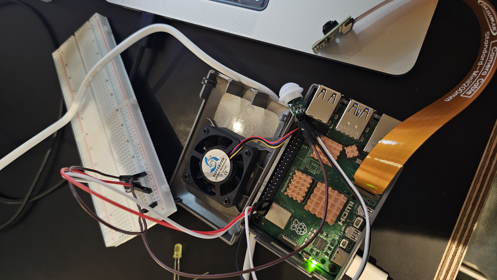

# IoT26-HW03 Team C (Cho Wooyoung, Seol Jaemin, Lim Youbin)

Since this assignment covers the fundamentals, we each decided to implement/practice the code individually to ensure a clear understanding of the Raspberry Pi GPIO control. As a result, there are three variations of code, performing the same
core task.

## Result
### Photos

### Videos
[HW3_webm.webm](https://github.com/user-attachments/assets/be2c21ba-ccf9-470d-be84-8889b2888e9c)
